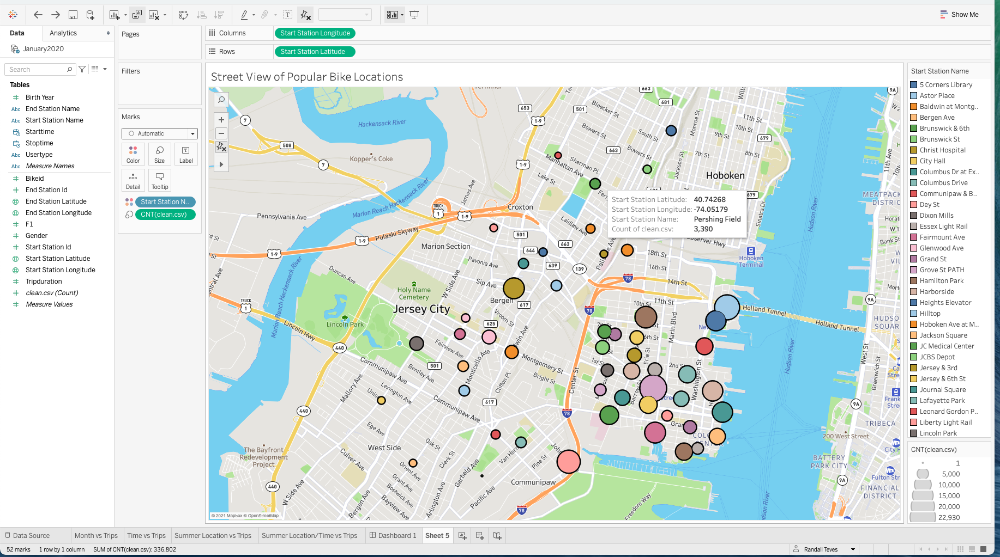
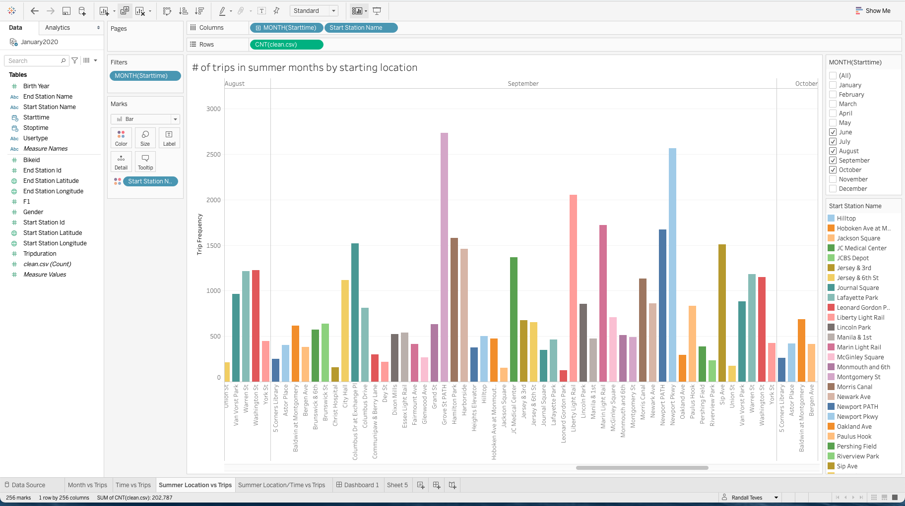
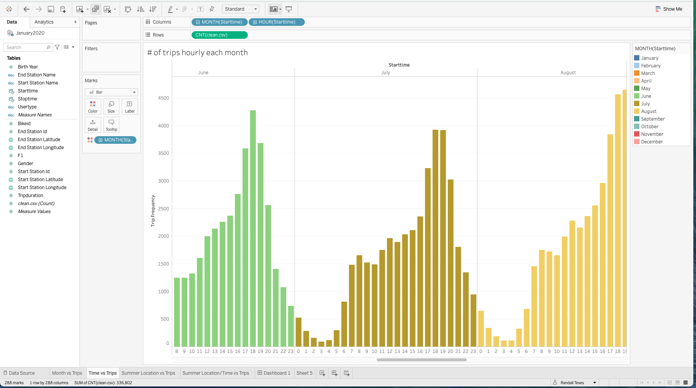

Since 2013, the Citi Bike Program has implemented a robust infrastructure for collecting data on the program's utilization. Through the team's efforts, each month bike data is collected, organized, and made public on the Citi Bike Data webpage.

However, while the data has been regularly updated, the team has yet to implement a dashboard or sophisticated reporting process. City officials have a number of questions on the program, so your first task on the job is to build a set of data reports to provide the answers.

Using Tableau, I create visualizations for data obtained for the entire year of 2020, then combine into a single dashboard, and finally, publish on a story. Images below show a few of the visualizations created.

